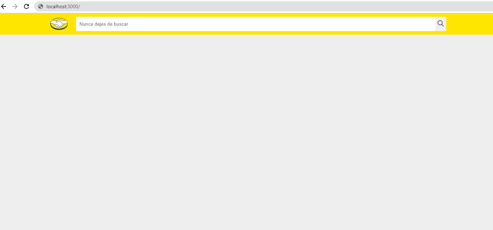
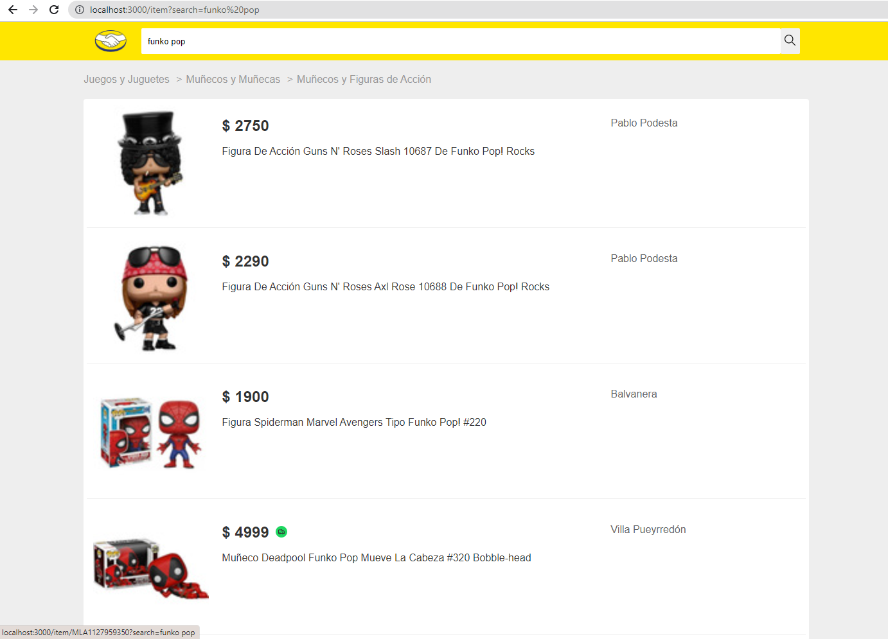
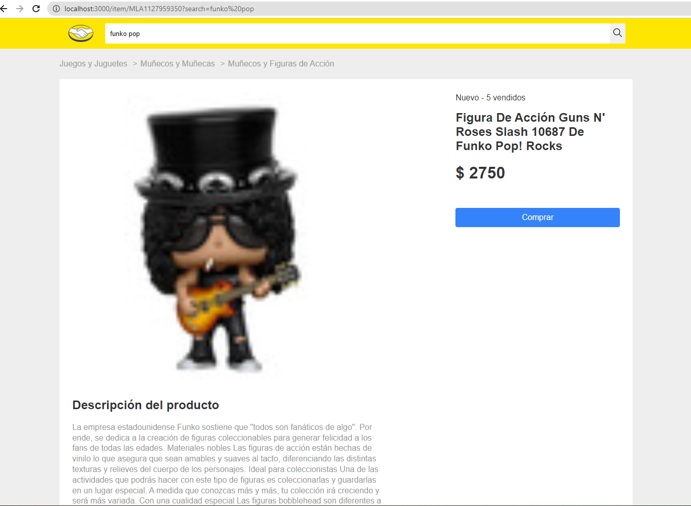
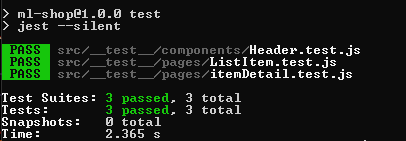
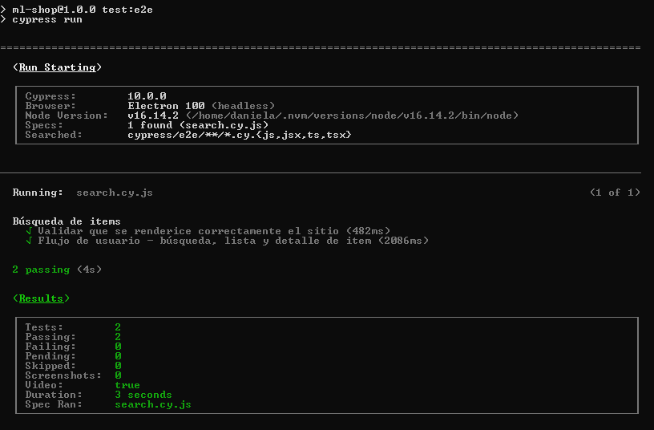
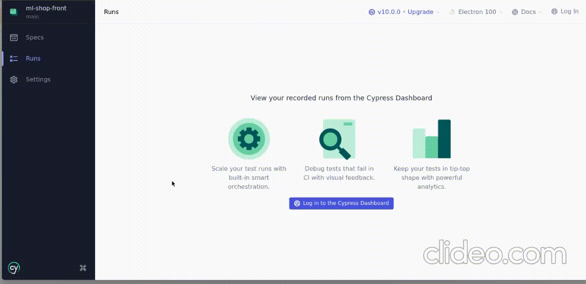

# Test Practico Frontend

Esta aplicación es una simulación para una tienda, en donde se realiza una petición con un parametro de busqueda y se obtienen los resultados del mismo.

En esta plataforma encontrara un buscador de texto en donde podra ingresar palabras claves con el objetivo de encontrar productos que tengan coincidencia. Al hacer clic en cada producto podra observar el detalle del mismo, como su imagen, nombre, precio y descripción.

## Estrategia de diseño de aplicaciones

Esta aplicación está diseñada para consumir un servicio de API REST utilizando React integrado con Node Js y archivos de configuración para declarar rutas, configuraciones, y componentes.

Esta aplicación se ha desarrollado utilizando React con router-dom, sass, babel, webpack etc., este proyecto está destinado a obtener y consumir API REST que manejen solicitudes http y devuelvan respuestas http json válidas.

## Iniciemos

Siga los subtemas a continuación para configurar su entorno, ejecutar el servidor web y trabajar con los puntos finales de la API Rest.

#### Requisitos del sistema operativo
Asegúrese de que se cumplan los siguientes requisitos antes de comenzar.

- Cliente git

#### Clonar el repositorio

```sh
git@github.com:Daniela10289/ml-shop-front.git
```

#### Instalar dependencias backend

para instalar las depencias que se encuentran en el archivo package.json es necesario ejecutar el siguiente comando

- npm install

#### Iniciar el servidor web

Ejecute la siguiente línea para iniciar el servidor

```sh
npm run start
```

## Realización de solicitudes HTTP a las API REST expuestas

Una vez inciados ambos servidores ml-shop-back y ml-shop-front en su terminal, se abrira una nueva pestaña en su navegador por defecto.
En la pantalla principal podra realizar las siguiente solicitudes

| Vista | URL |
| ------ | ------ |
| Inicio | http://localhost:3000/ |
| Vista |  |
| Lista de procuctos | http://localhost:3000/item?search=Iphod |
| Vista |  |
| Detalle del producto | http://localhost:3000/item/MLA899138095?search=Iphod |
| Vista |  |

# Pruebas unitarias

Esta sección explica cómo ejecutar las pruebas unitarias del proyecto

#### Estrategia de prueba

Escribir casos de prueba específicos antes de comenzar el desarrollo de la funcionalidad es una excelente manera de ahorrar validaciones o extensiones de alcance innecesarias, siguiendo la ideología de Jest he escrito casos de prueba específicos para validar cada componente necesario para la funcionalidad de la aplicación.

#### Ejecutando las pruebas unitarias

Para iniciar los casos de prueba es necesario ejecutar el siguiente comando

```sh
npm test
```

Una vez ejecutado el comando se podra observar en la terminal los resultados de cada prueba.



# Pruebas e2e

Las preubas e2e fueron realizadas con la herramienta cypress, la cual es una herramienta muy poderosa para realizar pruebas e2e y pruebas de intregración en aplicaciones web.

#### Estrategia de prueba

La estrategia utilizada para las pruebas e2e fue realizar la simulación de acciones que un usuario de la aplicación realizaria desde que ingresa al sitio, realiza una busqueda (en este caso ingresando el parámetro "Funko Pop"), observa los resultados obtenidos por el servidor backend, da clic al primer resultado encontrado y posteriormente es dirigido al detalle del producto donde se encuentra información como categorias, titulo, precio, descripción y opción de compra, etc.

#### Requisitos necesarios para las pruebas e2e

- Tener inciado el servidor del backend y el fronted con sus respectivos comandos de inicio
- Tener una configuración previa en su sistema operativo de cypress, en caso de que no cumpla con este requisito siga las instruciones de la documentación oficial [https://www.cypress.io/]
- Una vez lista la configuración de cypress ejecute el siguiente comando en una terminal nueva


```sh
npm run test:e2e
```
Al ejecutar este comando se podra observar el resultado de las pruebas desde la terminal



Para visualizar el proceso de las pruebas desde la interfaz grafica de cypress ejecute el siguiente comando

```sh
npm run cypress open
```

